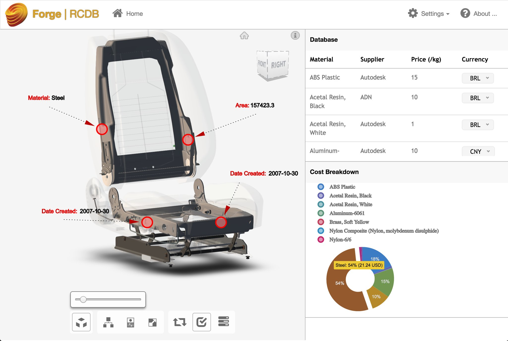

# Forge Responsive Connected Database

## Description

This is Forge Responsive Connected Database: A responsive React-based web application that showcases the use of Autodesk Forge Viewer and Forge web services, working in a connected environment with integrated data from multiple databases.

This project is based on the cool [React Redux Starter Kit](https://github.com/davezuko/react-redux-starter-kit)

## Prerequisites

To run these samples, you need your own Forge API credentials:

 * Visit the [Forge Developer Portal](https://developer.autodesk.com), sign up for an account
 * [Create a new App](https://developer.autodesk.com/myapps/create)
 * For this new App, you can use <b>http://localhost:3000/api/forge/callback/oauth</b> as Callback URL.
 * Take note of the <b>Client ID</b> and <b>Client Secret</b>, those are your API keys that must remain hidden
 * Install the latest release of [NodeJS](https://nodejs.org)
 * Clone this or download this project. It's recommended to install a git client such as [GitHub desktop](https://desktop.github.com/) or [SourceTree](https://www.sourcetreeapp.com/)
 * To clone it via command line, use the following (<b>Terminal</b> on MacOSX/Linux, <b>Git Shell</b> on Windows):

    > git clone https://github.com/Autodesk-Forge/forge-rcdb.nodejs

## Project Setup

WORK IN PROGRESS!!

    npm install

    // by default post-install step will run a production build
    // so for dev you need to run
    npm run build-dev

For database configuration, refer to config/

Model Schema:

    {
      "_id" : "mongoDB Id",
      "urn" : "model URN",
      "name" : "Model name",
      "path" : "...path of local svf for dev env ...",
      "env" : "AutodeskProduction" || "Local",
      "sequence" : [],
      "states" : [],
      "options" : {
      //extensions options
      },
      "thumbnail" : "... base64 encoded thumbnail ... "
    }

Material Schema:

   {
     "_id" : ObjectId("57ee6b26dfda94c109157449"),
     "name" : "Steel",
     "supplier" : "Autodesk",
     "currency" : "USD",
     "price" : 2.5
   }

## Live Demo

[https://forge-rcdb.autodesk.io](https://forge-rcdb.autodesk.io)

 

## License

[MIT License](http://opensource.org/licenses/MIT)

## Written by

Written by [Philippe Leefsma](http://twitter.com/F3lipek)

Forge Partner Development - [http://forge.autodesk.com](http://forge.autodesk.com)
